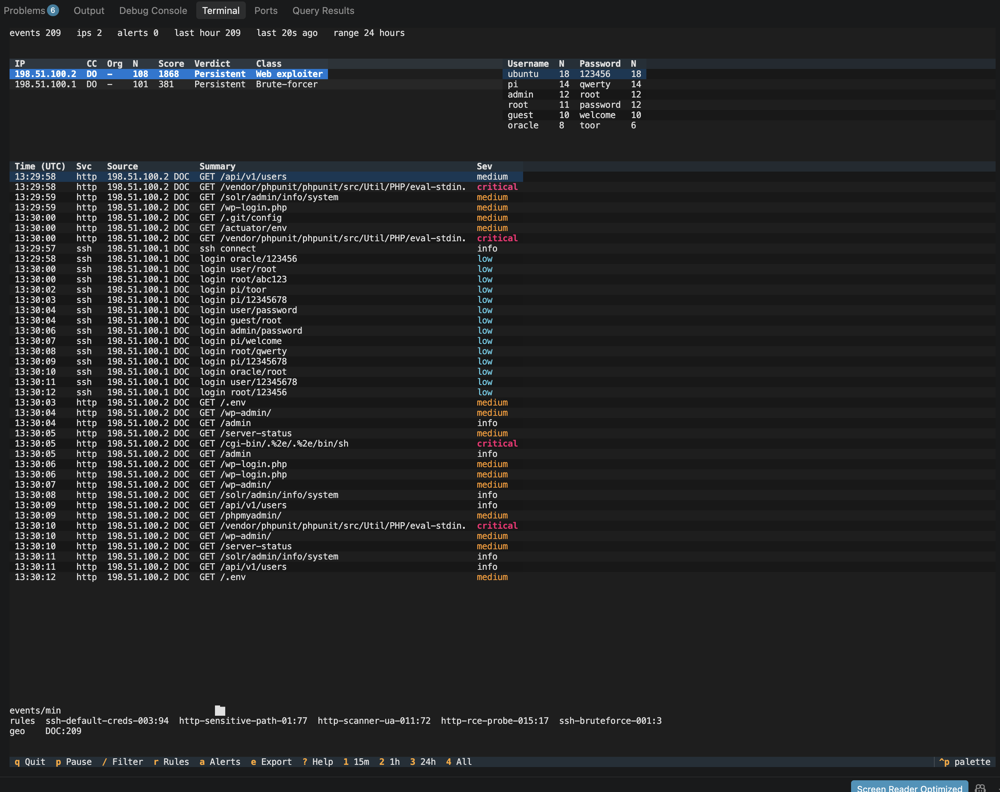
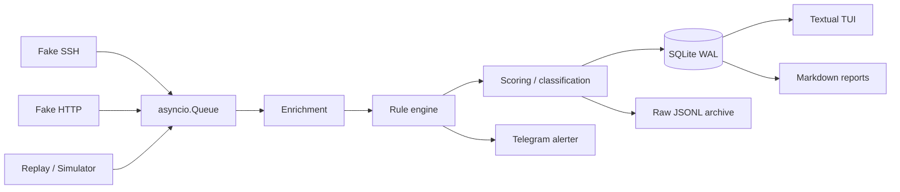

# HoneyWatch

HoneyWatch is a non-executing SSH and HTTP honeypot with YAML rule detection,
enrichment, source-IP scoring, SQLite storage, an append-only JSONL archive,
and a Textual terminal dashboard.

It simulates two realistic decoy services, records hostile traffic, enriches
events with GeoIP/ASN info where available, evaluates YAML detection rules,
maps detections to MITRE ATT&CK, scores source IPs over time, and lets you
browse and report on the results from the terminal.

The system is deliberately non-executing. The fake SSH shell never runs
attacker commands. HTTP uploads are never stored. Download commands never
fetch remote content. The honeypot is an observation system, not an
exploitation platform.

## What it does

- Runs a fake SSH service that accepts or rejects logins, serves a fake
  root shell, captures credentials and commands, and never executes anything
  supplied by the client.
- Runs a fake HTTP service that serves decoy pages, captures request paths,
  query strings, user agents, credentials in logins, and upload attempts.
- Feeds every captured event through an asyncio pipeline: enrichment, rule
  detection, scoring and storage.
- Classifies source IPs from `Noise` through `Persistent` using time-decayed
  rule-hit weights.
- Saves enriched events to SQLite in WAL mode and raw events to an append-only
  JSONL archive.
- Optionally sends high-severity detections to Telegram.
- Provides a read-only Textual dashboard for live or replayed traffic, plus
  Markdown report generation from the stored database.

## Quick start

Clone the repository, install the package in development mode, and validate the
bundled detection rules:

```bash
cd honeywatch
uv sync --dev
honeywatch rules validate
```

Demonstrate the dashboard against a seeded archive before there is any live
attack traffic:

```bash
honeywatch tui --replay data/raw/events.jsonl --speed 10
```

If you prefer pip:

```bash
python -m venv .venv
.venv/bin/pip install -e ".[dev]"
honeywatch rules validate
```

`honeywatch --version` prints the installed version.

## Recommended first run

A convincing local demo usually goes like this:

```bash
honeywatch doctor
honeywatch simulate --profile ssh-bruteforcer --profile credential-sprayer --rate 3 --duration 30s
honeywatch db stats
honeywatch report --since 30m
honeywatch tui
```

`simulate` generates traffic through the same pipeline the honeypots use, so it
is useful for profiling, testing and demoing without needing real attacker
traffic.


## Real-world example

If you want a reproducible demo you can see, start with docs/REAL_WORLD_EXAMPLE.md.

That walkthrough covers the full path from install through validation, simulation, dashboard inspection, replay, reporting and cleanup.


## Commands

```text
honeywatch run [--config PATH] [--no-ssh] [--no-http] [--duration 0]
honeywatch tui [--db PATH] [--replay FILE] [--speed N] [--refresh N]
honeywatch simulate
    [--profile NAME] [--rate N] [--duration 5m] [--seed N] [--db PATH]
honeywatch replay FILE [--speed N] [--db PATH]
honeywatch rules validate
honeywatch rules list
honeywatch rules test
honeywatch report
    [--since 24h] [--out FILE.md] [--db PATH] [--ip ADDRESS]
honeywatch db stats [--db PATH]
honeywatch db prune [--db PATH] [--days N] [--yes]
honeywatch doctor
```

Shared options:

- `--config`, `-c PATH` — YAML configuration file. If omitted, HoneyWatch looks
  at `$HONEYWATCH_CONFIG`, then `config/honeywatch.yaml`, then
  `config/honeywatch.example.yaml`.
- `--verbose`, `-v` — debug logging.
- `--version` — show the version and exit.

`honeywatch doctor` is the best first check. It verifies configuration, storage,
rules, listening ports and any configured integrations.

`honeywatch run` starts the collection daemon. Use `--duration` if you want it
to stop automatically after a fixed number of seconds, otherwise it runs until
interrupted.

`honeywatch tui` opens the dashboard. It is read-only and polls SQLite, so it
can be run in a different terminal from `honeywatch run`. Use `--replay` to feed
a JSONL archive into a temporary database and display it without starting the
daemon.

`honeywatch rules validate` exits non-zero if any rule file is invalid. `rules
list` prints the loaded rule catalogue. `rules test` runs the bundled rule
fixtures and reports pass/fail per rule.

`honeywatch report` generates a Markdown summary from the database. Use `--ip`
to focus on one source address, and `--out` to write the report to a file.

`honeywatch db prune` deletes events older than the retention window. The raw
JSONL archive is kept.

## Installation

From source:

```bash
python -m venv .venv
.venv/bin/python -m pip install --upgrade pip
.venv/bin/pip install -e ".[dev]"
```

With uv:

```bash
uv sync --dev
```

The package requires Python 3.12. Install dependencies from
`pyproject.toml`; the optional `dev` dependency set covers testing and linting.

To build a wheel or source distribution, use the package's build system:

```bash
python -m pip install build
python -m build
```


## **Live Version of the TUI**



## Configuration

HoneyWatch is configured with YAML. The bundled example lives at
`config/honeywatch.example.yaml`.

A minimal working configuration looks like:

```yaml
data_dir: ./data
log_level: INFO

ssh:
  enabled: true
  bind: 0.0.0.0
  port: 2222
  banner: "SSH-2.0-OpenSSH_8.9p1 Ubuntu-3ubuntu0.6"
  hostname: "srv-prod-02"
  accept_after_failures: 4
  weak_passwords:
    - "123456"
    - password
    - admin
    - root
    - toor
    - "12345678"
  max_connections: 100
  max_per_ip: 5
  session_timeout_s: 300
  idle_timeout_s: 60
    max_commands: 50

http:
  enabled: true
  bind: 0.0.0.0
  port: 8080
  server_header: "Apache/2.4.41 (Ubuntu)"
  max_body_bytes: 8192

rules:
  directory: ./rules
  reload_on_sighup: true

enrichment:
  geoip_city_db: ./data/geo/GeoLite2-City.mmdb
  geoip_asn_db: ./data/geo/GeoLite2-ASN.mmdb

scoring:
  half_life_hours: 6
  weights:
    info: 1
    low: 3
    medium: 8
    high: 20
    critical: 40

alerts:
  telegram:
    enabled: false
    token_env: HONEYWATCH_TG_TOKEN
    chat_id: ""
    min_severity: high
    max_per_hour: 20

storage:
  retention_days: 30
  queue_size: 10000
  raw_archive: true
  compress_after_days: 7
```

Notable settings:

- `data_dir` is the root for the database, raw archive and GeoIP data.
- SSH and HTTP can be enabled or disabled independently.
- `port: 0` asks the OS for an ephemeral port; the bound port is reported at
  startup and in the dashboard where relevant.
- GeoIP is optional. If the GeoLite2 databases are missing or paths are unset,
  `doctor` warns and the system continues without geo enrichment.
- Telegram alerting is disabled by default. When enabled, the token is read from
  the environment variable named in `token_env`, never from the config file.

Copy `config/honeywatch.example.yaml` to `config/honeywatch.yaml` and edit it;
the default config search path prefers that file.

## Detection model

Rules are YAML and intentionally simpler than Sigma. A rule can be stateless or
threshold-based. The bundled catalogue contains 17 rules across SSH, HTTP and
cross-service reconnaissance, including:

- SSH brute force and credential spraying
- Default-credential logins
- Post-login reconnaissance and persistence commands
- Payload-download patterns
- HTTP scanning, sensitive-path probing, SQLi probes, traversal attempts and
  suspicious user agents
- Multi-service recon correlations

Severity weights:

| Severity | Weight |
| -------- | ------ |
| info     | 1      |
| low      | 3      |
| medium   | 8      |
| high     | 20     |
| critical | 40     |

Source-IP scores decay with a six-hour half-life:

```text
score(ip, now) = Σ weight(hit) × 0.5 ^ ((now - hit.ts) / 6h)
```

Verdicts:

- `< 10` — Noise
- `10–39` — Suspicious
- `40–99` — Hostile
- `>= 100` — Persistent

## Architecture



Key points:

- The collection daemon and the TUI are separate processes.
- The daemon owns collection and writes; the TUI is read-only and polls
  SQLite.
- Closing the TUI must never stop collection.
- Replay and simulation feed the same pipeline the honeypots use.
- Sanitisation is centralized: attacker-controlled strings are stripped of
  terminal control sequences, bounded in length, and escaped before they reach
  the terminal, reports or alerts.

## Repository layout

```text
honeywatch/
  README.md
  AGENTS.md
  IMPLEMENTATION.md
  ACCEPTANCE.md
  pyproject.toml
  config/honeywatch.example.yaml
  rules/
    ssh/
    http/
    cross/
  docs/
  src/honeywatch/
    __init__.py
    cli.py
    config.py
    models.py
    pipeline.py
    daemon.py
    doctor.py
    alerts.py
    enrich/
    sanitize.py
    scoring.py
    scoring_service.py
    storage/
    honeypots/
    engine/
    replay/
    report/
    simulate_cmd.py
    simulator.py
    tui/
  tests/
    unit/
    integration/
    fixtures/
  deploy/
  scripts/
```

## Safety boundary

HoneyWatch is an observation system, not an exploitation platform.

- Never execute attacker-supplied commands.
- Never evaluate attacker-supplied code.
- Never fetch attacker-supplied URLs.
- Never persist uploaded files.
- Never expose a real shell.
- Never place the honeypot on a network containing real sensitive systems or
  data.
- Never commit secrets, GeoLite databases, raw logs, host keys or live attacker
  data.
- Always sanitize attacker-controlled strings before terminal, report or
  Telegram output.

If you deploy it on a VPS, bind the honeypots to the interfaces you intend to
expose, restrict SSH access to the management host, and treat the honeypot host
as untrusted.

## Limitations

This first version intentionally has:

- no TLS on the HTTP honeypot
- no machine learning
- no malware sandbox
- no real shell
- no active countermeasures
- no multi-user web dashboard
- no external database

GeoIP is approximate, and rule tuning remains manual.

## Development

```bash
uv sync --dev
ruff check src tests
uv run pytest
```

The project uses ruff for formatting and linting, and pytest with
pytest-asyncio for tests. The `integration` marker is used for tests that start
real local listeners and drive them with real clients.


## License

MIT
